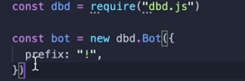

# Revert Reading

## What does _"Revert Reading"_ do?

Revert reading is self explanatory, essentially reverts how codes are able to read from. 

## How do I begin or use it?

It's a very simple process, to begin with you must head over where you define the package.

Then you must add the following `revertReading` below the options.



## Setup 



```javascript
const dbd = require("dbd.js")

const bot = new dbd.Bot({
  prefix: "!", //Prefix is able to be changed
  revertReading: true, //true or false
})
```



## Usage



```javascript
bot.assignType(bot.Types.Message, bot.createCommmand({
  name:"ram", //Command Name
  code:"$pingms - $botPingms" //Code
}))
```




Once enabled revertReading the functions will be read from bottom to top


> The functions are read from top to bottom by default.

> By revert Reading it will read from bottom to top.

